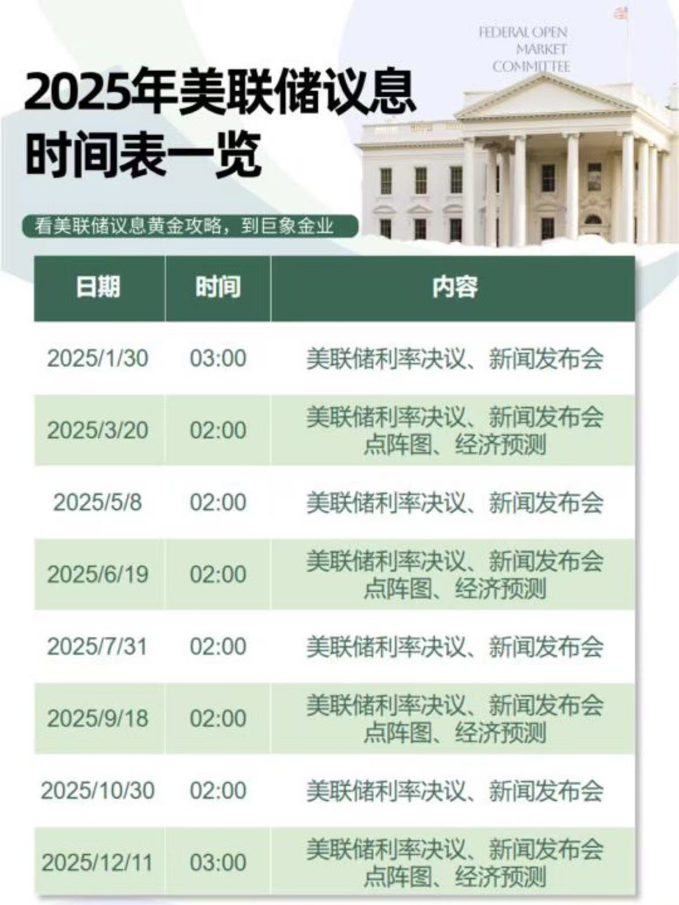

# GoldTracker

## 数据来源

有两种数据获取方式

-   通过网页爬取所需要的数据
-   通过开放 API 获取数据

### 数据爬取

目标地址：

-   [金投网](https://quote.cngold.org/gjs/jjs.html)

### API 获取

开放平台：

-   [探数 API](https://www.tanshuapi.com/)
-   [nowapi]()

### 运行应用

```bash
uvicorn main:app --reload
```

### 影响因素

股指期货交割日:每月的第三个星期五

美联储加息日：



## 环境配置

1. 复制 `.env.example` 文件并重命名为 `.env`
2. 在 `.env` 文件中填入你的 Supabase 配置信息：
    - SUPABASE_URL: 你的 Supabase 项目 URL
    - SUPABASE_KEY: 你的 Supabase API 密钥
